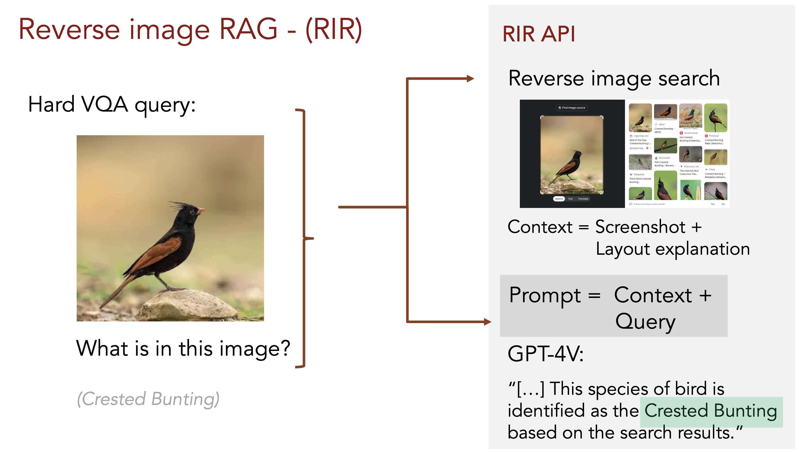
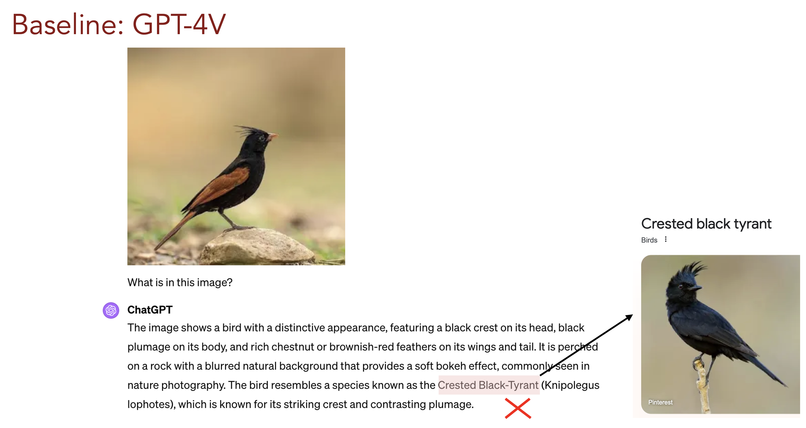
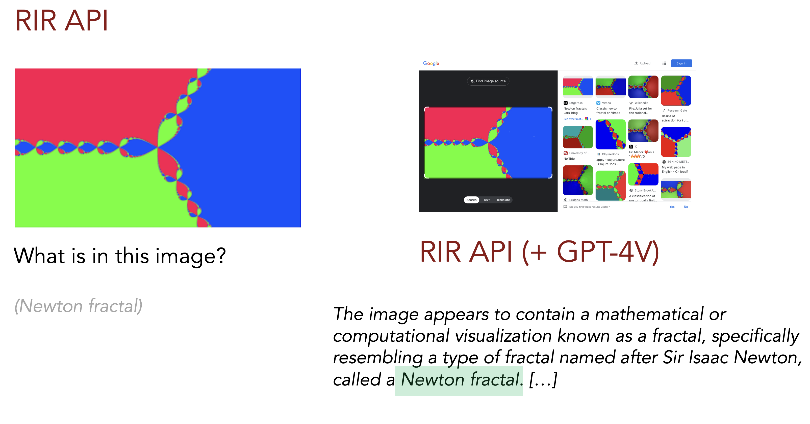
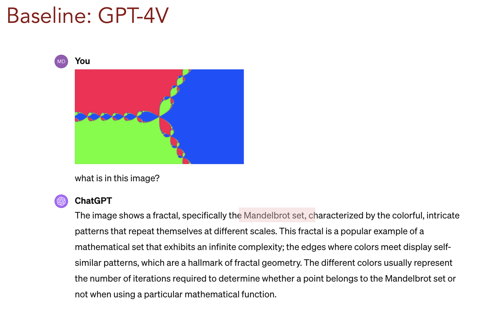
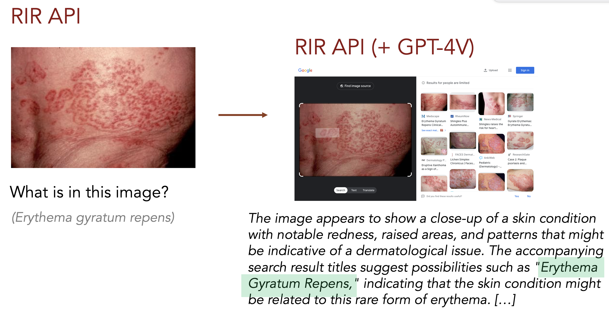
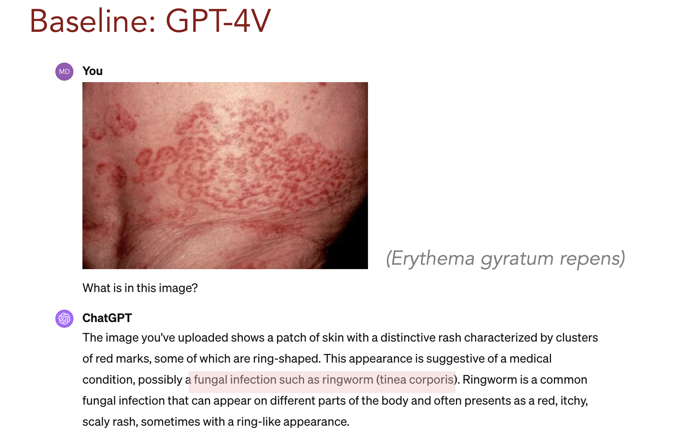

# Reverse Image RAG - (RIR) 






### Synopsis: 
We build an API to retrieval-augment vision-language models with visual context retrieved from the web.

Concretely, for a query image and query text (e.g. a question), we leverage reverse image search to find most similar images and their titles / captions.

The final product is a VLM-API that allows to automatically leverage reverse-image-search based retrieval augmentation.  


### Usage:  

```pip install rir_api```

```python
import rir_api 

api = rir_api.RIR_API(openai_api_key)

image_url = "https://encrypted-tbn1.gstatic.com/images?q=tbn:ANd9GcSgN8RDkURVE8mgOf-n02TqJdC2l1o5cVFA32NpZtuVp8MaFfZY"
query_text = "What is in this image?"
response = api.query_with_image(image_url, query_text)
# >> runs reverse image search
# >> formats visual context prompt
# >> queries VLM with full query
```

(see run.py for minimal example)

### Next steps  

- modularized API interface
- information extraction from search results 

Feel free to ping me under mdmoor[at]cs.stanford.edu if you're interested in contributing.

### Reference:  

@misc{Moor2024,  
  author = {Michael Moor},  
  title = {Reverse Image RAG~(RIR)},  
  year = {2024},  
  publisher = {GitHub},  
  journal = {GitHub Repository},  
  howpublished = {\url{https://github.com/mi92/reverse-image-rag}},   
}

### More teaser examples:









